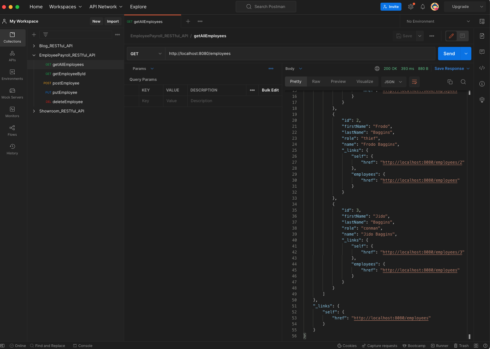
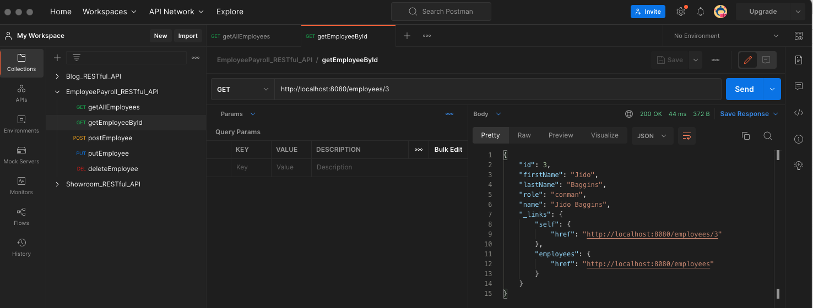
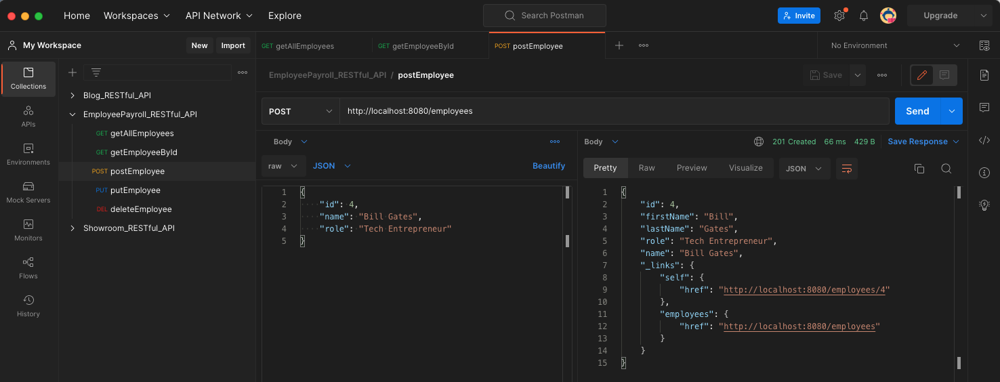
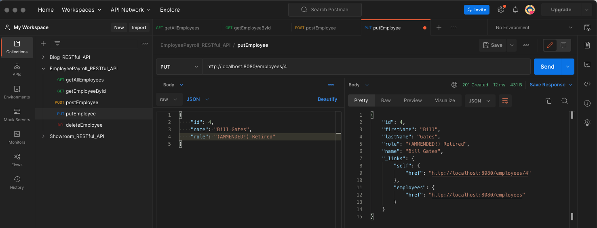
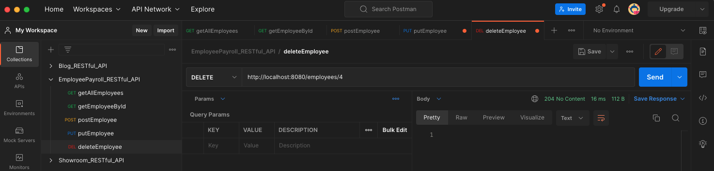
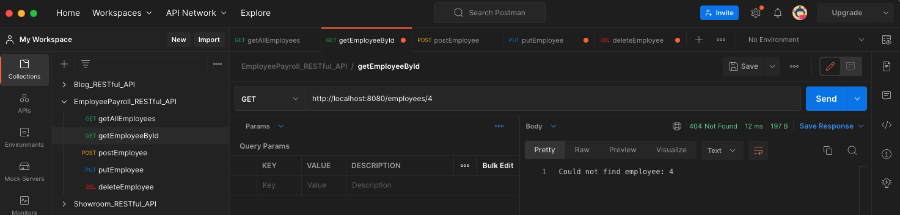

# Project Title:

Employee Payroll Management System (A RESTful API for Spring Boot)

## 1. What is the project?

> "Big picture: We’re going to create a simple payroll service that manages the employees of a company. 
We’ll store employee objects in a (H2 in-memory) database, and access them (via something called JPA). 
Then we’ll wrap that with something that will allow access over the internet (called the Spring MVC layer) ..."

> "Introducing Spring HATEOAS, a Spring project aimed at helping you write hypermedia-driven outputs. 
To upgrade your service to being RESTful, add this to your build: ... "

-- Building REST services with Spring (Spring Guide)

#### This is an Employee Payroll Management RESTful API for Spring Boot, which performs CRUD operations on an in-memory database.

#### An implementation of a SPRING quide: "Building REST services with Spring".

## 2. Tech Stack:

- Java 17
- Spring MVC
- Spring Boot
- Spring HATEOAS
- Java JPA
- H2 Database.
- JSON
- Postman

## 3. Installing:

i. Clone the git repo

```
https://github.com/AAdewunmi/Employee-Payroll-Management-System.git
```

ii. Open project folder

iii. Explore

## 4. How To Use

i. Open project in preferred IDE (I'm using SpringToolSuit4) 

ii. Run as a Spring Boot App

iii. Test RESTful API end points using Postman for CRUD operations:

- Get All Employees
- Get Employee By ID
- Post Employee
- Put Employee
- Delete Employee

## 5. Demo

- Get All Employees



- Get Employee By ID



- Post Employee



- Put Employee



- Delete Employee



- Check Employee has been deleted!



## 6. Contributing:

Pull requests are welcome. For major changes, please open an issue first to discuss what you would like to change at:

Spring Guide Github Repo: https://github.com/spring-guides/tut-rest.


## 7. Original Creator:

Author:  SPRING by VMware Tanzu

Tutorial Name: "Building REST services with Spring"

Spring URL: https://spring.io/guides/tutorials/rest/
 
Github Project Name: Building REST Services with Spring

Github URL: https://github.com/spring-guides/tut-rest
